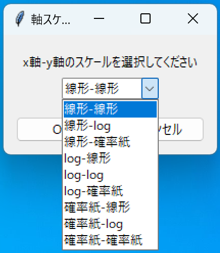
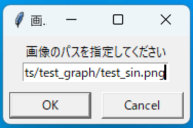
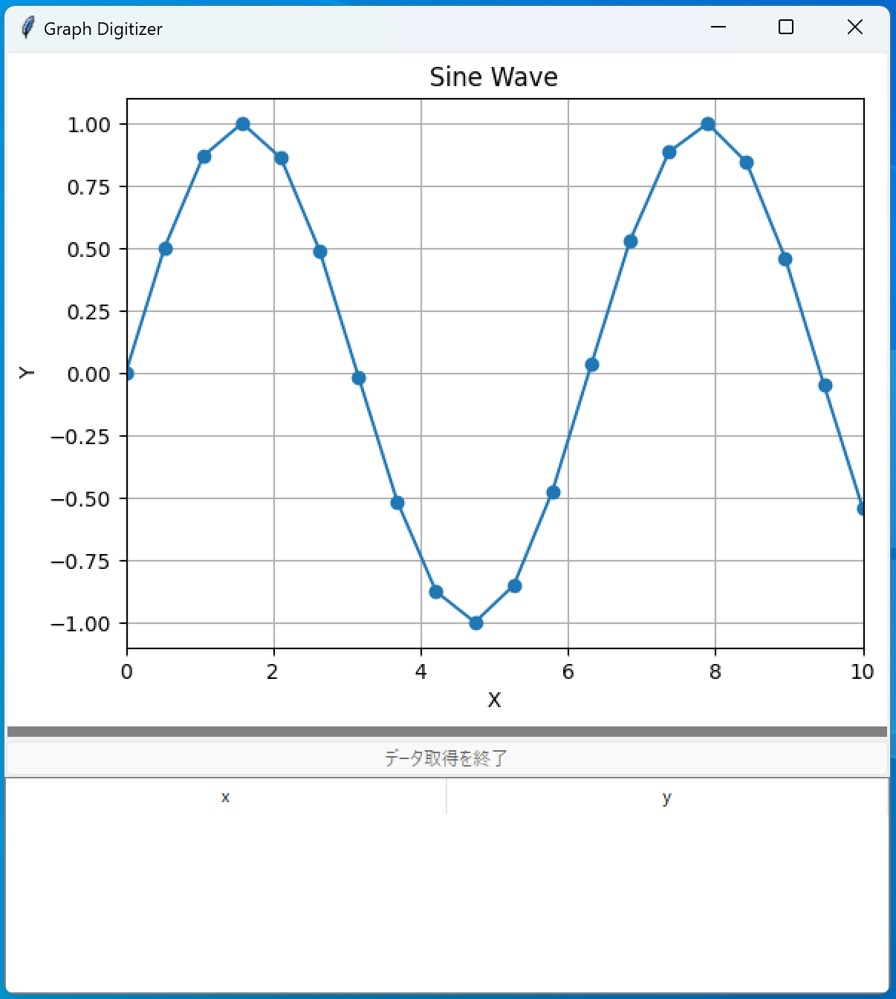
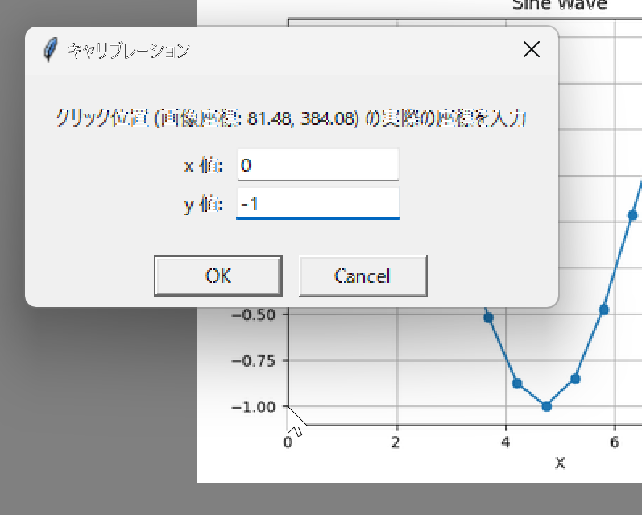
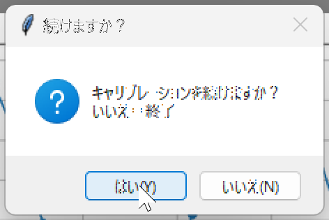
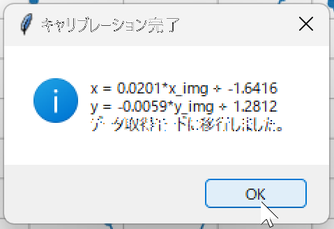
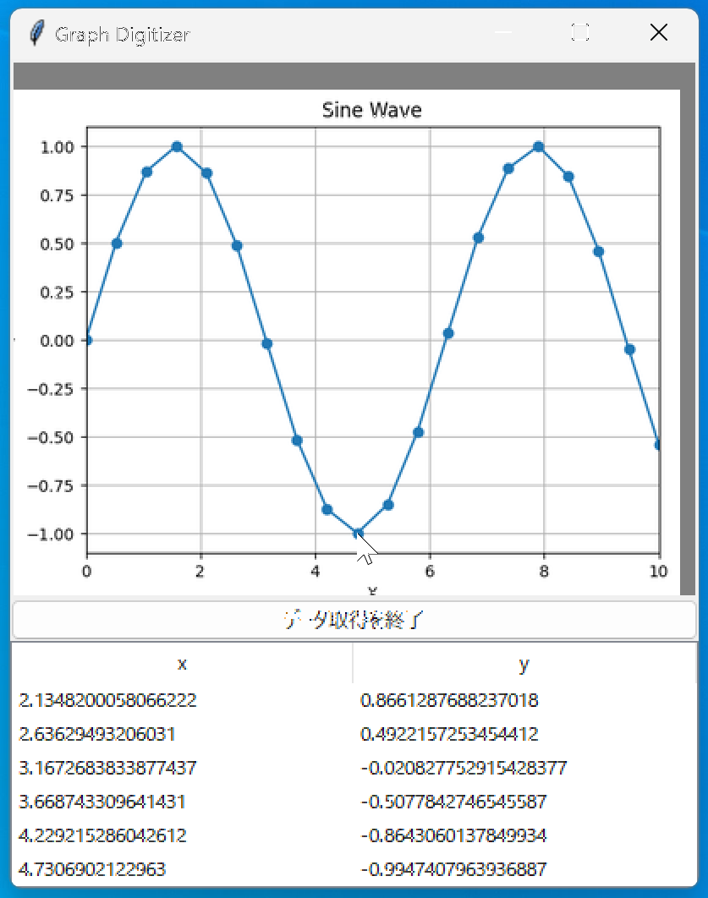
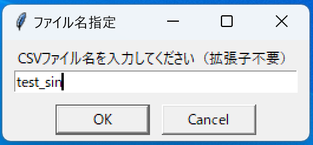
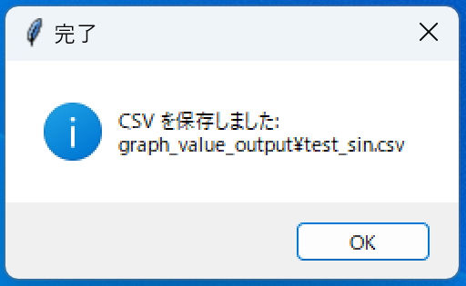

# Graph Digitizer (対応スケール：線形・log・確率紙)

これは、グラフの画像ファイルからデータポイントを数値化するためのグラフィカルツールです。
x、y軸共に線形、log、確率紙スケールに対応しており、これらを組み合わせた計9パターンのモードを選べます。

## 概要

このツールを使用すると、論文やレポートに含まれるグラフの画像から、手動でデータポイントを抽出し、CSVファイルとして保存できます。画像のパンやズームに対応しており、正確な位置でのデータ取得が可能です。

## 機能

- 画像ファイルの読み込み（PNG, JPEGなど）
- 2点以上の基準点を用いた線形座標系のキャリブレーション
- クリックによるデータポイントの取得
- 取得したデータのリアルタイム表示
- マウス操作による画像のパン（中クリックドラッグ）とズーム（マウスホイール）
- 取得したデータポイントをCSVファイルに出力
- 線形 / 対数 / 確率紙（正規確率プロット）スケールに対応した軸変換

## 依存ライブラリ

このスクリプトは、以下のPythonライブラリに依存しています。

- NumPy
- Pillow

## インストール

リポジトリ直下の `run_graph_digitizer.bat`（Windows）または `run_graph_digitizer.sh`（Linux/macOS）を実行すると、仮想環境が存在しない場合に自動で作成され、`numpy` と `pillow` が導入されたうえでアプリが起動します。通常はこれらのランチャーだけでセットアップと起動が完結します。なお、作成される仮想環境の容量は、作者環境の Python 3.13.1 環境では約82MBでした。

手動で仮想環境を準備したい場合のみ、`create_env.sh`（Linux/macOS）または `create_env.bat`（Windows）を一度実行すれば、`numpy` と `pillow` が導入済みの環境が `.venv` 配下に作成されます。2回目以降は再実行する必要はありません。

または、自前で仮想環境を構築する場合は、venv作成後、下記コマンドでNumPyとPillowをインストールしてください。

```bash
pip install numpy pillow
```

## 使い方

1. **起動**

   コマンドラインから `graph_digitizer.py` を実行します。Windows の場合は `run_graph_digitizer.bat` をダブルクリックして起動しても同じ処理が行われます。Linux/macOS では `run_graph_digitizer.sh` を利用できます。

   - 画像ファイルを指定せずに起動する場合（ファイル選択ダイアログが開きます）:
     ```bash
     python graph_digitizer.py
     ```

   - 画像ファイルを指定して起動する場合:
     ```bash
     python graph_digitizer.py path/to/your/image.png
     ```
    起動するとスケール選択画面が表示されます。

    

    画像パスを指定（またはファイルダイアログで選択）して読み込みます。

    

    読み込み後、メインウィンドウに対象グラフが表示されます。

    

2. **キャリブレーション**

   - プログラムを起動すると、まずキャリブレーションモードになります。
   - グラフの軸上の既知の点をクリックします（例: x軸の最小値と最大値、y軸の最小値と最大値など）。
   - クリックするたびに、その点の実際の座標 (x, y) を入力するダイアログが表示されます。これにより、画像のピクセル座標とグラフの実際の座標との間の線形変換を計算します。
   - **注意**: このプログラムの線形変換は、グラフの軸が画像の水平・垂直軸と平行であることを前提としており、画像の傾き（回転）は考慮しません。
   - 軸を確率紙に設定した場合は、入力単位（0–1の小数、または0–100%）を選択後にキャリブレーションでも同じ単位で入力してください。0および100（小数の場合は0と1）は使用できません。
   - 最低2点のキャリブレーションが必要です。キャリブレーションを終了すると、データ取得モードに移行します。

   キャリブレーション中の操作例。

   

   追加の基準点を続けるかの確認ダイアログ。

   

   完了後の表示例。

   

3. **データ取得**

   - データ取得モードでは、グラフ上のデータポイントをクリックします。
   - クリックした点の座標が計算され、ウィンドウ下部のリストに表示されます。

   データ取得中の画面例。

   

4. **画像の操作**

   - **パン**: マウスの中ボタンを押しながらドラッグします。
   - **ズーム**: マウスホイールをスクロールします。

5. **終了と保存**

   - 「データ取得を終了」ボタンをクリックします。
   - ファイル名を入力するダイアログが表示されます。
   - 指定したファイル名で、取得したデータが `graph_value_output` ディレクトリにCSVファイルとして保存されます。

   CSVファイル名の指定画面。

   

   保存完了の通知。

   

## ライセンス

このプロジェクトはMITライセンスの下で公開されています。

## 免責事項

本ソフトウェアの使用によって生じたいかなる損害についても、作者は一切の責任を負いません。自己の責任においてご使用ください。

